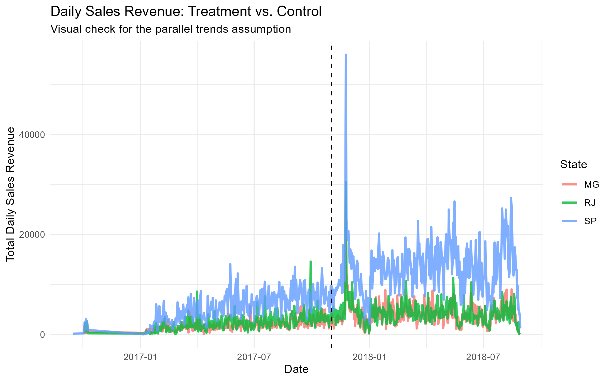
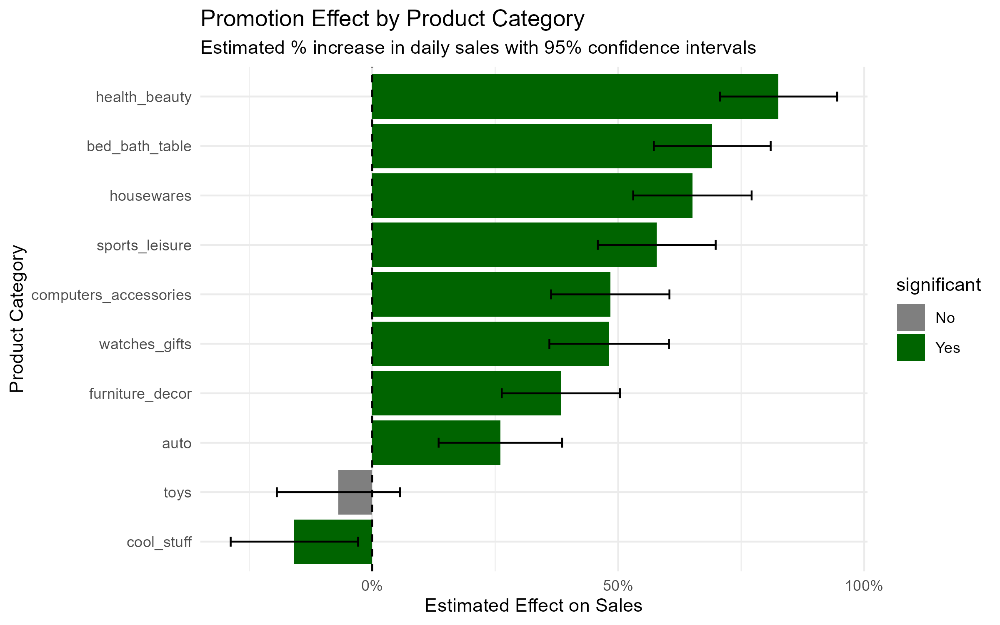

# 📦 Causal Impact Analysis of a Sales Promotion

This R project analyzes the causal impact of a simulated free shipping promotion on e-commerce sales using the Olist dataset from Brazil. The goal was to estimate the promotion’s effectiveness, test its robustness, and translate findings into actionable business recommendations.

---
## 📌 Executive Summary

* **What happened**: The free shipping promotion increased sales overall, but the impact was not uniform across categories.
* **So what**: Blanket promotions are inefficient; targeted promotions maximize ROI.
* **Key result**: The `health_beauty` category saw an **82.6% lift**, equal to **R$69** in additional daily profit.
* **What’s next**: Pilot targeted promotions in top-performing categories and validate with a controlled A/B test.

---
## 📂 Project Structure
├── data/              # Raw Olist dataset (CSV files)
├── outputs/           # Saved plots (.png files)
│   ├── sales_trends.png
│   ├── promotion_effects.png
├── report.Rmd         # Main analysis (RMarkdown notebook)
├── report.html        # Final polished HTML report
└── README.md          # Project documentation (this file)

---
## 📊 Key Results

### 1. Sales Trends Before & After Promotion

*Dashed line = promotion start. The treatment state (SP) diverges from control states post-promotion, consistent with a causal effect.*

### 2. Category-Level Promotion Effects

*The promotion’s effect varies widely by category. `health_beauty` shows a strong, statistically significant lift, while others remain neutral or even negative.*

---
## 🔧 Methods & Tools
* **Data Wrangling**: `tidyverse`, `lubridate`
* **Modeling**: Two-Way Fixed Effects Regression (`fixest::feols`)
* **Validation**: Placebo Test for robustness
* **Visualization**: `ggplot2`
* **Reporting**: R Markdown
* **Version Control**: Git & GitHub

---
## 💡 Strategic Recommendations
* **Recommendation**: Focus promotions on high-response categories (`health_beauty`, `bed_bath_table`) instead of blanket campaigns.
* **Business Impact**: Estimated **R$69** in daily incremental profit from `health_beauty` alone.
* **Future Analysis**: Investigate why these categories respond better (margins, repeat customers, product type).
* **Next Step**: Confirm findings with a formal A/B test to reduce risk of seasonal bias.

---
## ⚠️ Limitations & Assumptions
* **Placebo Test**: A false positive effect (14.8%) appeared when shifting the promotion date earlier, suggesting seasonality may confound results.
* **Model Assumptions**: Difference-in-differences relies on parallel trends; future work could test advanced time-series or causal impact models.

---
## 🎓 Learning Reflection
This project helped me practice:
* Building and cleaning relational datasets with attention to data quality assurance.
* Applying causal inference methods (Difference-in-Differences, Placebo Test).
* Communicating technical findings through business-ready insights and visualizations.

I also recognized key limitations (seasonality, model assumptions) and proposed improvements (A/B testing). I look forward to further developing these skills during the Google Data Analytics Apprenticeship.

---
## 🚀 How to Reproduce
1.  Clone this repository.
2.  Download the dataset from Kaggle: [Olist Brazilian E-Commerce Dataset](https://www.kaggle.com/datasets/olistbr/brazilian-ecommerce)
3.  Place the necessary CSV files in the `data/` folder.
4.  Open the `.Rproj` file in RStudio.
5.  Run the `report.Rmd` file.
